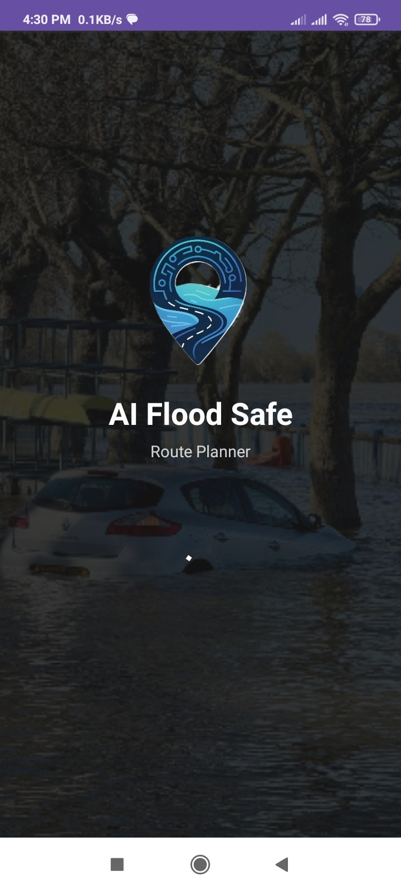
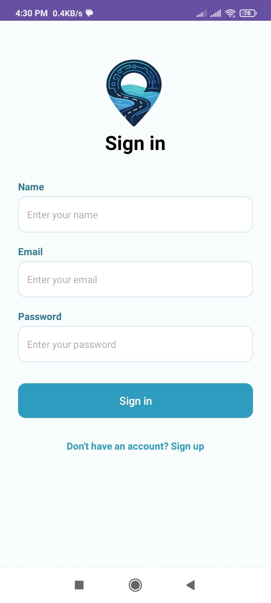
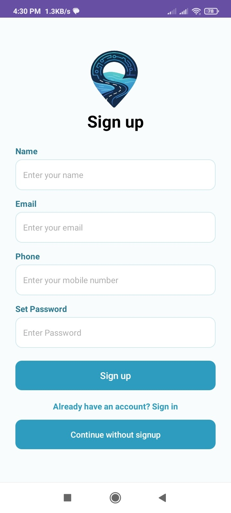
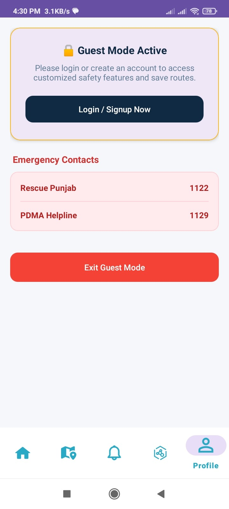
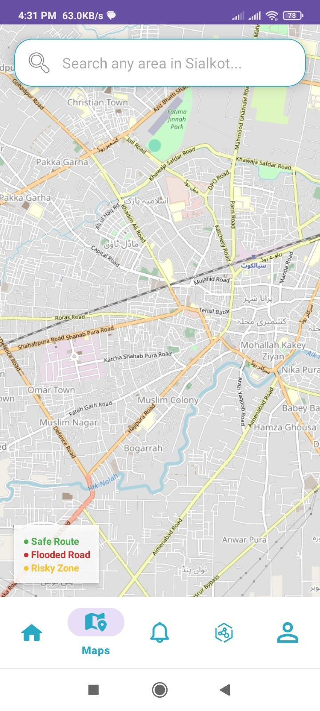
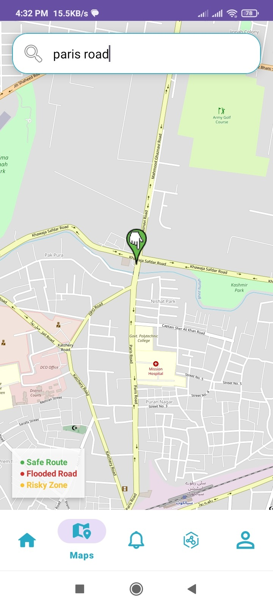
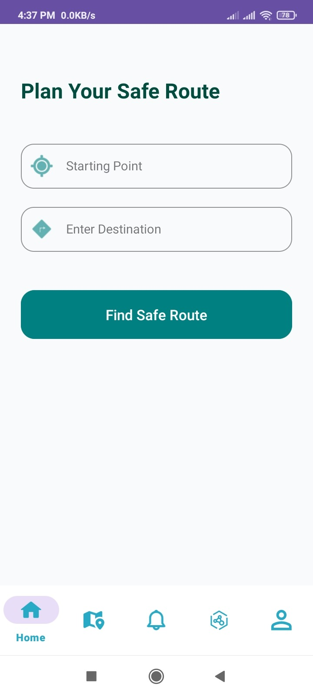
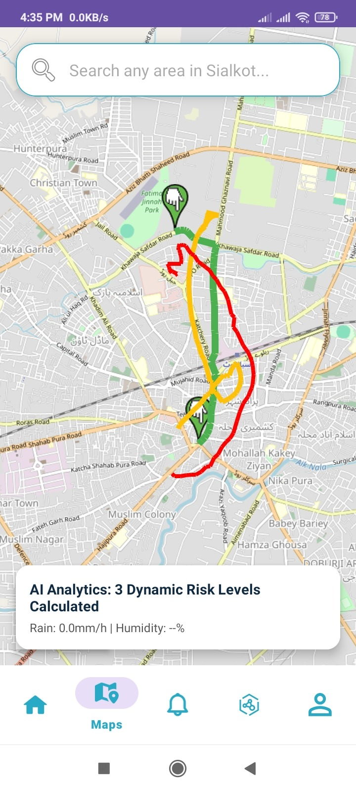

# 🌊 AI-Powered Flood-Safe Route Planner

> An offline-first Android application that predicts flood risk and computes the safest navigable route through flood-prone urban terrain — built as a Final Year Project focused on **Sialkot City, Pakistan**.

---

## 📖 Overview

Urban flooding regularly cuts off roads and strands commuters in cities like Sialkot, but existing navigation apps (Google Maps, Waze) have no concept of *flood risk* — they will happily route a driver straight into a waterlogged street. This project solves that gap with a **fully offline, AI-driven routing engine** that:

- Predicts flood likelihood and severity using historical and real-time environmental data
- Builds a 3D road network where elevation and flood risk are encoded as edge weights
- Computes the safest path using a custom **3D Dijkstra algorithm** — not just the shortest one
- Runs entirely on-device, with no dependency on constant cloud connectivity

The result is a navigation assistant designed for exactly the moment when connectivity and infrastructure are most likely to fail: during a flood.

---

## 📸 App Walkthrough & User Interface

### 1. Splash, Authentication & Guest Mode Bypass
| Splash Screen | Secure Sign In | Secure Sign Up | Guest Mode Interface |
| --- | --- | --- | --- |
|  |  |  |  |

### 2. Live Terminal & Safe Route Querying
| Dashboard Terminal | Route Destination Setup | Simple Map & Location Search |
| --- | --- | --- |
|  |  |  |

### 3. Predictive Analytics & Emergency Broadcasts
| Real-Time Live Alerts Engine | Predictive Analytics & Graph |
| --- | --- |
|  |  |

### 4. Smart Maps & Dynamic Risk Rendering
| Geographic Engine / Search | Alternative Route Paths | 3-Level Risk Layout Engine |
| --- | --- | --- |
|  |  |  |

---

## ❗ Problem Statement

During monsoon flooding, conventional GPS navigation systems:
- Treat all roads as equally safe, ignoring real-time flood conditions
- Rely heavily on continuous internet access and cloud inference, which is unreliable in disaster scenarios
- Provide no predictive warning — they react to road closures rather than anticipating flood-prone zones

This project addresses these gaps with a lightweight, predictive, and offline-capable system suitable for low-connectivity, low-resource environments.

---

## ✨ Key Features

- 🧠 **Flood Prediction Models** — XGBoost (proposed primary model) and LSTM for time-series flood and rainfall forecasting
- 🗺️ **3D Dijkstra Routing Engine** — Custom pathfinding algorithm where elevation and flood-risk scores are factored directly into edge weights, not just distance
- 📡 **Offline-First Architecture** — TensorFlow Lite for on-device inference and OpenStreetMap for offline map rendering — no constant cloud dependency
- ⚡ **Low Hardware Footprint** — Optimized for mid-range Android devices, built for accessibility over raw compute power
- 🌧️ **Real-Time Alerts** — Live weather and rainfall data integration for current-condition risk updates
- 📊 **Analytics Dashboard** — Visualizes flood trends, rainfall patterns, and historical risk zones

---

## 🏗️ System Architecture

┌─────────────────────────────────────────────────────────┐
│                 Presentation Layer                      │
│         (Fragments: Home, Maps, Alerts, Analytics)       │
└───────────────────────────┬───────────────────────────────┘
│  MVVM
┌───────────────────────────▼───────────────────────────────┐
│                      ViewModel Layer                      │
│               (State management, UI logic)                │
└───────────────────────────┬───────────────────────────────┘
│
┌───────────────────┼───────────────────┐
▼                   ▼                   ▼
┌───────────────┐   ┌───────────────┐   ┌───────────────────┐
│  TFLite Model │   │  3D Dijkstra  │   │  OSM Offline Map  │
│  (Flood/Rain  │   │  Router Engine│   │     Rendering     │
│   Prediction) │   │ (Risk-weighted│   │                   │
│               │   │     edges)    │   │                   │
└───────────────┘   └───────────────┘   └───────────────────┘

**Tech Stack:**

| Layer | Technology |
|---|---|
| Language | Kotlin |
| Architecture | MVVM |
| ML Inference | TensorFlow Lite |
| Prediction Models | XGBoost, LSTM |
| Routing Algorithm | Custom 3D Dijkstra |
| Mapping | OpenStreetMap (offline) |
| Backend / Auth | Firebase (Firestore, Auth) |
| Charts | MPAndroidChart |

---

## 🛰️ Data Sources

The flood prediction pipeline is trained on multi-source geospatial and meteorological data:

| Source | Purpose |
|---|---|
| **NASA SRTM** | Digital elevation modeling for terrain analysis |
| **ESA WorldCover** | Land-use and land-cover classification |
| **HydroSHEDS** | Hydrological drainage and river network data |
| **OpenWeather API** | Real-time weather and rainfall data |
| **PMD (Pakistan Meteorological Department)** | Localized historical rainfall and flood records |

---

## 📲 App Modules

- **Home** — Dashboard overview of current flood risk status
- **Maps** — Interactive offline map with route visualization
- **Plan Route** — Source/destination input with flood-aware route computation
- **Alerts** — Real-time flood and weather alerts for Sialkot
- **Analytics** — Historical trends, rainfall charts, and risk visualizations
- **Profile / Auth** — Firebase-backed sign-in and user profile management

---

## ⚙️ Getting Started

### Prerequisites
- Android Studio (latest stable)
- Android SDK 24+
- A Firebase project (for Firestore/Auth) — `google-services.json` is **not included** in this repo for security reasons
- An OpenWeather API key — [Get one here](https://home.openweathermap.org/api_keys)

### Setup

1. Clone the repository
   ```bash
   git clone https://github.com/Samina2004/AI-Flood-Safe-Route-Planner.git
Add your own google-services.json to the app/ directory (from your Firebase console)

Create a local.properties file in the project root and add:

Properties
OPENWEATHER_API_KEY=YOUR_OPENWEATHER_API_KEY_HERE
Open in Android Studio, let Gradle sync, and run on an emulator or device (minSdk 24+)

---

## 🎯 **Project Scope & Focus**

This project deliberately prioritizes:
*   **Offline functionality** over cloud-dependent AI pipelines
*   **Minimal hardware requirements** over high-compute model complexity
*   **Low latency inference** over larger, slower model architectures
*   **A risk-aware routing algorithm** over simple shortest-path navigation

*These constraints reflect the real-world conditions of flood-affected areas — unreliable connectivity, limited device capability, and the need for fast, actionable guidance.*

---

## 👩‍💻 **Author**

**Samina Nawaz**  
*Final Year — BS Information Technology, University of Sargodha*  
**Supervised by:** Dr. Bushra Jamil

---

## 📄 **License**

This project is developed as an academic **Final Year Project**. Feel free to explore the code for learning purposes. For reuse or collaboration inquiries, please reach out directly.
